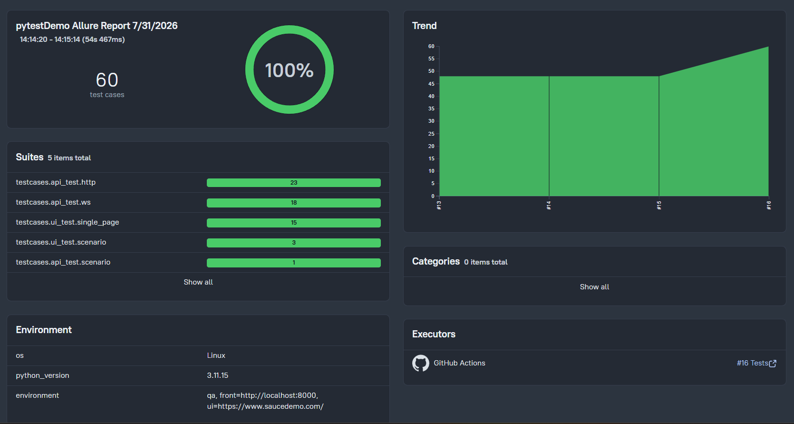
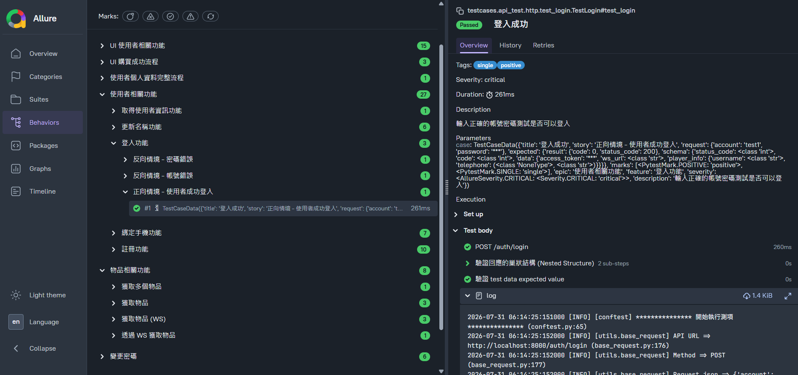
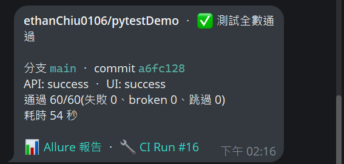

# Pytest Web UI/API 自動化測試框架

[](https://github.com/ethanChiu0106/pytestDemo/actions/workflows/tests.yml)

📊 **[線上 Allure 測試報告](https://ethanchiu0106.github.io/pytestDemo/)** — 由 CI 每日自動執行並發佈，含歷次趨勢圖

## 簡介

基於 Pytest 的自動化測試框架，專為驗證**Web UI**, **WebSocket API** 和 **Restful API** 而設計。

## 專案目的

此框架主要用於前端、後端的自動化測試：

* **Web UI 測試**：整合 Playwright ，並採用 Page Object Model (POM) 設計模式。
* **WebSocket API 測試**：利用 `asyncio` 和 `websockets` 處理非同步通訊。
* **Restful API 測試**：透過 `requests` ，提供 Restful API 請求發送與回應驗證能力。
* **報告可讀性**：整合 Allure Report，生成豐富且易於分析的測試報告，幫助快速定位問題。
* **模組化與可維護性**：採用模組化設計，將 API 請求、測試資料和測試案例分離，便於擴展和維護。
* **集中式設定管理**：透過 `secrets.yml` 統一管理不同環境的設定與密鑰，提高安全性與配置彈性。

## 主要功能

* **UI 自動化**：使用 Playwright 進行跨瀏覽器 Web 測試。
* **非同步 WebSocket 測試**：支援 `async/await` 語法，處理 WebSocket 連線和訊息交換。
* **Restful API 測試**：使用 `requests` 庫，提供 HTTP 請求發送和回應處理。
* **Allure 報告整合**：自動生成詳細的測試執行報告，包含步驟和環境資訊。
* **動態資料驅動**：測試資料由 test_data 目錄下的 Python 產生器動態生成。
* **模組化 API 封裝**：將複雜的 API 請求邏輯封裝在獨立的類別中，簡化測試案例編寫。
* **環境特定設定**：透過命令列參數切換不同的測試環境（如 QA, Dev）。

## 使用工具

* **語言**：Python 3.11+
* **測試框架**：Pytest
* **環境與套件管理**：uv
* **開發流程輔助**：pre-commit
* **Lint / Format**：Ruff
* **Web UI 測試**：Playwright
* **WebSocket 客戶端**：websockets
* **Restful API 客戶端**：requests
* **資料序列化**：msgpack
* **資料壓縮**：gzip
* **測試報告**：Allure Report
* **Python 版本管理**：pyenv (可選)

## 安裝與設定

### 先決條件

* Git
* Python 3.11+
* uv
* Allure 2.44.1

### 步驟

1. **clone 後進入專案**：

   ```bash
   cd pytest-demo
   ```
2. **設定 Python 版本 (可選, 如使用 pyenv)**：

   ```bash
   pyenv install 3.11.9
   pyenv local 3.11.9
   ```
3. **建立虛擬環境並同步依賴 (使用 uv)**：

   ```bash
   # 根據 uv.lock 同步依賴並建立.venv
   uv sync
   ```
4. **安裝 Playwright 瀏覽器核心**：

   ```bash
   uv run playwright install
   ```
5. **設定密鑰與環境變數**：

   ```bash
   # 複製模板檔案
   cp config/secrets.yml.template config/secrets.yml
   ```

   接著，請開啟 `config/secrets.yml` 並填入您環境所需的設定值與帳號密碼。此檔案已被 `.gitignore` 忽略，不會被提交到版本庫中。
6. **安裝 Git 掛鉤 (Hook)**：
   使用 `pre-commit` 來自動化維護任務。請安裝 Git 掛鉤以啟用此功能：

   ```bash
   uv run pre-commit install
   ```

## 使用方式

### 執行測試

⚠️ **重要提示：關於 API 測試案例的執行環境**

目前 **API 測試案例** (包括 HTTP 和 WebSocket) 是針對**自架的簡易後端 Server** 所設計和驗證的。

**若要直接執行這些 API 相關的測試案例** (例如執行 `testcases/api_test` 下的測試，或執行所有測試)，需**先下載並啟用該 Server**。

**Server 專案連結：** [`mock-server`](https://github.com/ethanChiu0106/mockServer)。

若不想 clone 該專案，也可直接用 CI 發佈的 image 啟動：

```bash
docker run --rm -p 8000:8000 -e SECRET_KEY=any-secret ghcr.io/ethanchiu0106/mockserver:latest
```

---

使用 `--env` 參數來指定要執行的測試環境。

**範例：**

* **執行 QA 環境的所有測試(API + UI)**：

  ```bash
  uv run pytest --env qa
  ```
* **執行所有 API 測試 / 所有 UI 測試**（結構用路徑選）：

  ```bash
  uv run pytest --env qa testcases/api_test
  uv run pytest --env qa testcases/ui_test
  ```
* **僅執行 API 的 HTTP 測試**（子目錄同理：`ws/`、`scenario/`）：

  ```bash
  uv run pytest --env qa testcases/api_test/http
  ```
* **跨 API/UI 選層級或方向**（橫切維度用 marker 選）：

  ```bash
  uv run pytest --env qa -m scenario
  uv run pytest --env qa -m negative
  ```

### 生成並查看 Allure 報告

在執行測試並生成 `allure-results` 後：

```bash
allure generate allure-results --clean -o allure-report
allure open allure-report
```

> **關於 Trend**：Allure 2 的趨勢圖靠 `allure-results/history` 累積，而 `--clean-alluredir` 會在每次 pytest 啟動時清空該目錄。本專案已在 conftest 的 session 結束時自動把上一份 `allure-report/history` 接回去，並遞增 `executor.json` 的 `buildOrder`，因此照上面的指令跑即可累積趨勢（官方上限為最近 20 份報告）。**前提是不要刪掉 `allure-report/`**——刪了等於把歷史一併清空。

Allure Report 效果





## 開發流程與 Pre-commit

設定了一個 pre-commit 掛鉤，會在每次 `git commit` 時自動執行，以確保 `config/secrets.yml.template` 檔案與 `config/secrets.yml` 的結構保持同步。

### 自動更新 `secrets.yml`

當修改了 `config/secrets.yml` ，pre-commit 掛鉤會偵測到這個變動，並在 commit 時自動更新 `secrets.yml.template`。

這個機制採用了 `pre-commit` 的流程：

1. `git commit` 時，掛鉤執行並修改了 `secrets.yml.template`。
2. `pre-commit` 會故意讓這次 commit **失敗**，提醒有檔案被自動修改了。
3. 此時需要將被修改的 `secrets.yml.template` 手動 `git add`。
4. 再次執行 `git commit`，這次就會成功。

### 建議的順暢工作流程

為了避免 commit 被中斷，建議採用以下流程：

1. 在修改完程式碼和 `config/secrets.yml` 之後。
2. 在執行 `git add` 之前，手動執行一次掛鉤：
   ```bash
   uv run pre-commit run update-secrets-template
   ```
3. 現在，一次性將所有變更加入暫存區：
   ```bash
   git add .
   ```
4. 執行 `git commit`，這次將會一次通過。

### 配置檔案

* `config/secrets.yml`: 核心設定檔，用於存放所有環境的 URL、帳號密碼及其他敏感資訊。**此檔案不應被提交到 Git**。
* `config/secrets.yml.template`: `secrets.yml` 的模板檔案，定義了設定檔應有的結構。

## CI/CD (GitHub Actions)

推送到 `main`、發 PR、每日排程（台灣時間 02:00）或手動觸發時，自動執行完整流程：

1. **Lint**：`ruff check` + `ruff format --check`（鎖定 0.13.2，與本機一致）
2. **API 測試**：以 service container 拉起 mock-server 的 image
   （`ghcr.io/ethanchiu0106/mockserver`），不需手動架設後端
3. **UI 測試**：獨立 job 與 API 測試並行，打公開的 SauceDemo，以 chromium / firefox / webkit 三瀏覽器各跑一輪（本機同樣可用重複的 `--browser` 參數選擇瀏覽器，預設 chromium）
4. **報告發佈**：合併兩個 job 的結果，生成含趨勢圖的 Allure 報告並發佈到
   GitHub Pages——每輪以 run number 版本化，保留最近 20 輪
5. **Telegram 通知**：附測試統計與報告連結，等 Pages 部署完成後才發送



📊 最新報告：[https://ethanchiu0106.github.io/pytestDemo/](https://ethanchiu0106.github.io/pytestDemo/)

## 專案結構

```
pytest-demo/
├── .github/workflows/  # CI/CD (lint、測試、Allure 報告發佈、Telegram 通知)
├── api/                # 封裝 WebSocket 和 Restful API 請求邏輯 
├── pages/              # 封裝 UI 測試的 Page Object Model (POM) 
├── config/             # 環境設定檔 (secrets.yml, secrets.yml.template)
├── scripts/            # 工具腳本 (例如 pre-commit用的)
├── docs/images/        # README 使用的截圖
├── testcases/          # 測試案例
│   ├── api_test/       # API 測試 (http, ws, scenario)
│   └── ui_test/        # UI 測試 (single_page, scenario)
├── test_data/          # 測試案例所需的資料模型與生成邏輯
│   ├── api_test_data/  # API 測試資料 (http, ws, scenario)
│   └── ui_test_data/   # UI 測試資料 (single, scenario)
├── utils/              # 底層工具 (config_loader, BaseRequest, AsyncBaseWS, allure_reporting 等)
├── allure-results/     # Allure 測試結果輸出目錄
├── allure-report/      # 生成的 Allure 報告目錄
├── conftest.py         # Pytest fixture 和 hook 函數 (根目錄)
├── pytest.ini          # Pytest 配置 (包含 markers )
├── pyproject.toml      # 專案依賴與建置設定
├── uv.lock             # 鎖定的依賴版本檔案
└── .gitignore          # Git 忽略檔案設定
```
